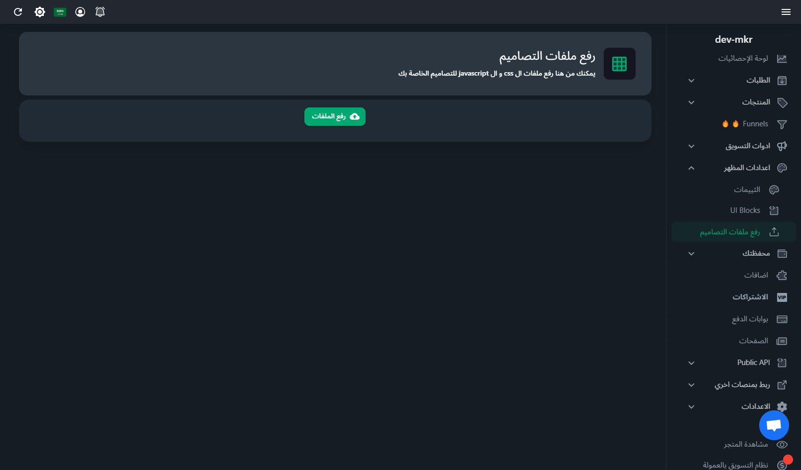

# Custom Theme Creation

EasyOrders allows users to create custom themes for their stores by selecting a base theme, making CSS changes, and uploading the customized CSS file to style their store as they desire.

## 1. Choosing a Skeleton Theme

Start by selecting a base theme from the available themes. This base theme will serve as the foundation for your custom design.

Available themes can be found [here](https://themes-docs.easy-orders.net/docs/category/themes).

## 2. Customizing with CSS

After selecting your skeleton theme, you can override the default styles by adding custom CSS. This CSS will allow you to adjust the visual elements such as colors, fonts, margins, etc.

### How to Write Custom CSS

1. Create a `.css` file and define your styles.
2. Use the existing HTML structure and apply your custom classes or override default theme styles.

**Example:**

```css
/* Example custom styles */
body {
  background-color: #f4f4f4;
}

h1 {
  color: #333;
  font-family: Arial, sans-serif;
}

.product-card {
  border: 1px solid #ddd;
  padding: 10px;
}
```

## 3. Uploading the CSS File

Once you have created your custom CSS file, you can upload it to EasyOrders to apply the styles to your store.

### Steps to Upload:

1. Navigate to the [**https://seller.easy-orders.net/#/upload-assets**](https://seller.easy-orders.net/#/upload-assets) in your store's dashboard panel.



2. Upload the `.css` file you've created.
3. Once uploaded, you will receive a link to the CSS file, copy it.

**Example URL after upload:**
https://files.easy-orders.net/17295967886114574.css

4. Go to [**https://seller.easy-orders.net/#/header-code**](https://seller.easy-orders.net/#/header-code) then paste and save the link in the following formate

```html
<link
  rel="stylesheet"
  type="text/css"
  href="https://files.easy-orders.net/17295967886114574.css"
/>
```

:::info
replace the link with your uploaded css file link
:::


<!-- #

#### 1. Create a new CSS file

#### 2. Add styles and classes you want to modify according to your selected theme -->

<!-- #### 3.  -->
